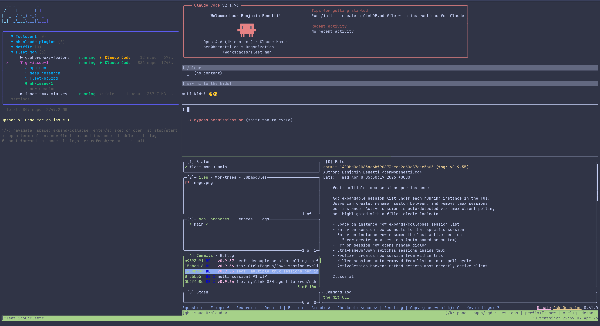

# fleet-man

A CLI/TUI tool for managing fleets of devcontainers. Spawn, name, exec into, and manage multiple devcontainer instances easily



## Install

```bash
curl -sL https://raw.githubusercontent.com/BenjaminBenetti/fleet-man/main/install.sh | sh
```

## Usage

Run `fleet` with no arguments to launch the interactive TUI, or use subcommands directly:

```bash
# Launch TUI
fleet

# Spawn instances from the current repo
fleet up agent-1
fleet up agent-2

# Stop and restart an existing instance without removing it
fleet stop agent-1
fleet start agent-1

# List instances
fleet ls

# Exec into an instance
fleet exec agent-1 bash

# Open VS Code on an instance
fleet code agent-1

# View logs
fleet logs agent-1

# Remove an instance
fleet down agent-1

# Remove a fleet and all its instances
fleet destroy my-project

# Spawn from anywhere with explicit repo
fleet up agent-1 --repo git@github.com:org/my-project.git

# Reference an existing fleet from anywhere
fleet up my-project/agent-3
```

## TUI Keybindings

| Key | Action |
|-----|--------|
| `j/k` | Navigate |
| `space` | Expand/collapse fleet |
| `enter/e` | Exec into instance |
| `s` | Stop/start instance |
| `o` | Open instance in new terminal |
| `a` | Add instance |
| `n` | New fleet |
| `d` | Delete instance/fleet |
| `c` | Open VS Code |
| `l` | View logs |
| `r` | Refresh |
| `q` | Quit |

## Requirements

- Linux
- Docker
- [devcontainer CLI](https://github.com/devcontainers/cli) (`npm install -g @devcontainers/cli`)
